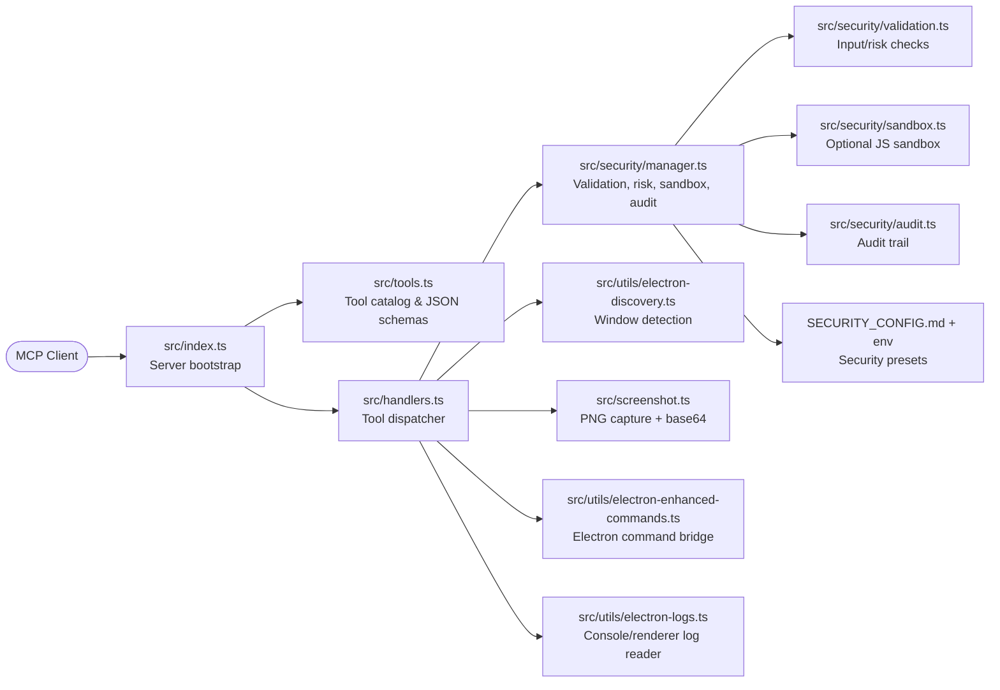

# Electron MCP Server

[](https://github.com/halilural/electron-mcp-server/blob/master/LICENSE)
[](https://www.npmjs.com/package/electron-mcp-server)
[](https://modelcontextprotocol.io)

A powerful Model Context Protocol (MCP) server that provides comprehensive Electron application automation, debugging, and observability capabilities. Supercharge your Electron development workflow with AI-powered automation through Chrome DevTools Protocol integration.

## 🗺️ Architecture Overview



- **Server bootstrap (`src/index.ts`)** wires the MCP server, registers tools, and streams requests over stdio.
- **Tool catalog (`src/tools.ts` + `src/schemas.ts`)** exposes the supported commands with Zod schemas exported as JSON Schema for client-side validation.
- **Request dispatcher (`src/handlers.ts`)** validates tool arguments, invokes the security manager, and routes calls to Electron command, screenshot, discovery, or log utilities.
- **Defense-in-depth (`src/security/*`)** layers input validation, risk scoring, optional sandboxing, and audit logging while honoring security level presets from environment variables or `SECURITY_CONFIG.md`.

## Demo

See the Electron MCP Server in action:

[](https://vimeo.com/1104937830)

**[🎬 Watch Full Demo on Vimeo](https://vimeo.com/1104937830)**

*Watch how easy it is to automate Electron applications with AI-powered MCP commands.*

## 🎯 What Makes This Special

Transform your Electron development experience with **AI-powered automation**:

- **🔄 Real-time UI Automation**: Click buttons, fill forms, and interact with any Electron app programmatically
- **📸 Visual Debugging**: Take screenshots and capture application state without interrupting development
- **🔍 Deep Inspection**: Extract DOM elements, application data, and performance metrics in real-time
- **⚡ DevTools Protocol Integration**: Universal compatibility with any Electron app - no modifications required
- **🚀 Development Observability**: Monitor logs, system info, and application behavior seamlessly

## 🔒 Security & Configuration

**Configurable security levels** to balance safety with functionality:

### Security Levels

- **🔒 STRICT**: Maximum security for production environments
- **⚖️ BALANCED**: Default security with safe UI interactions (recommended)
- **🔓 PERMISSIVE**: More functionality for trusted environments
- **🛠️ DEVELOPMENT**: Minimal restrictions for development/testing

### Environment Configuration

Configure the security level and other settings through your MCP client configuration:

**VS Code MCP Settings:**

```json
{
  "mcp": {
    "servers": {
      "electron": {
        "command": "npx",
        "args": ["-y", "electron-mcp-server"],
        "env": {
          "SECURITY_LEVEL": "balanced",
          "SCREENSHOT_ENCRYPTION_KEY":"your-32-byte-hex-string"
        }
      }
    }
  }
}
```

**Claude Desktop Configuration:**

```json
{
  "mcpServers": {
    "electron": {
      "command": "npx",
      "args": ["-y", "electron-mcp-server"],
      "env": {
        "SECURITY_LEVEL": "balanced",
        "SCREENSHOT_ENCRYPTION_KEY":"your-32-byte-hex-string"
      }
    }
  }
}
```

**Alternative: Local .env file (for development):**

```bash
# Create .env file in your project directory
SECURITY_LEVEL=balanced
SCREENSHOT_ENCRYPTION_KEY=your-32-byte-hex-string
```

**Security Level Behaviors:**

| Level           | UI Interactions | DOM Queries | Property Access | Assignments | Function Calls           | Risk Threshold |
| --------------- | --------------- | ----------- | --------------- | ----------- | ------------------------ | -------------- |
| `strict`      | ❌ Blocked      | ❌ Blocked  | ✅ Allowed      | ❌ Blocked  | ❌ None allowed          | Low            |
| `balanced`    | ✅ Allowed      | ✅ Allowed  | ✅ Allowed      | ❌ Blocked  | ✅ Safe UI functions     | Medium         |
| `permissive`  | ✅ Allowed      | ✅ Allowed  | ✅ Allowed      | ✅ Allowed  | ✅ Extended UI functions | High           |
| `development` | ✅ Allowed      | ✅ Allowed  | ✅ Allowed      | ✅ Allowed  | ✅ All functions         | Critical       |

**Environment Setup:**

1. Copy `.env.example` to `.env`
2. Set `SECURITY_LEVEL` to your desired level
3. Configure other security settings as needed

```bash
cp .env.example .env
# Edit .env and set SECURITY_LEVEL=balanced
```

### Secure UI Interaction Commands

Instead of raw JavaScript eval, use these secure commands:

```javascript
// ✅ Secure button clicking
{
  "command": "click_by_text",
  "args": { "text": "Create New Encyclopedia" }
}

// ✅ Secure element selection
{
  "command": "click_by_selector",
  "args": { "selector": "button[title='Create']" }
}

// ✅ Secure keyboard shortcuts
{
  "command": "send_keyboard_shortcut",
  "args": { "text": "Ctrl+N" }
}

// ✅ Secure navigation
{
  "command": "navigate_to_hash",
  "args": { "text": "create" }
}
```

See [SECURITY_CONFIG.md](./SECURITY_CONFIG.md) for detailed security documentation.

## 🎯 Proper MCP Usage Guide

### ⚠️ Critical: Argument Structure

**The most common mistake** when using this MCP server is incorrect argument structure for the `send_command_to_electron` tool.

#### ❌ Wrong (causes "selector is empty" errors):

```javascript
{
  "command": "click_by_selector",
  "args": "button.submit-btn"  // ❌ Raw string - WRONG!
}
```

#### ✅ Correct:

```javascript
{
  "command": "click_by_selector",
  "args": {
    "selector": "button.submit-btn"  // ✅ Object with selector property
  }
}
```

### 📋 Command Argument Reference

| Command                                       | Required Args                                                                           | Example                                            |
| --------------------------------------------- | --------------------------------------------------------------------------------------- | -------------------------------------------------- |
| `click_by_selector`                         | `{"selector": "css-selector"}`                                                        | `{"selector": "button.primary"}`                 |
| `click_by_text`                             | `{"text": "button text"}`                                                             | `{"text": "Submit"}`                             |
| `fill_input`                                | `{"value": "text", "selector": "..."}` or `{"value": "text", "placeholder": "..."}` | `{"placeholder": "Enter name", "value": "John"}` |
| `send_keyboard_shortcut`                    | `{"text": "key combination"}`                                                         | `{"text": "Ctrl+N"}`                             |
| `eval`                                      | `{"code": "javascript"}`                                                              | `{"code": "document.title"}`                     |
| `get_title`, `get_url`, `get_body_text` | No args needed                                                                          | `{}` or omit args                                |

### 🔄 Recommended Workflow

1. **Inspect**: Start with `get_page_structure` or `debug_elements`
2. **Target**: Use specific selectors or text-based targeting
3. **Interact**: Use the appropriate command with correct argument structure
4. **Verify**: Take screenshots or check page state

```javascript
// Step 1: Understand the page
{
  "command": "get_page_structure"
}

// Step 2: Click button using text (most reliable)
{
  "command": "click_by_text",
  "args": {
    "text": "Create New Encyclopedia"
  }
}

// Step 3: Fill form field
{
  "command": "fill_input",
  "args": {
    "placeholder": "Enter encyclopedia name",
    "value": "AI and Machine Learning"
  }
}

// Step 4: Submit with selector
{
  "command": "click_by_selector",
  "args": {
    "selector": "button[type='submit']"
  }
}
```

### 🐛 Troubleshooting Common Issues

| Error                            | Cause                            | Solution                         |
| -------------------------------- | -------------------------------- | -------------------------------- |
| "The provided selector is empty" | Passing string instead of object | Use `{"selector": "..."}`      |
| "Element not found"              | Wrong selector                   | Use `get_page_structure` first |
| "Command blocked"                | Security restriction             | Check security level settings    |
| "Click prevented - too soon"     | Rapid consecutive clicks         | Wait before retrying             |

## 🛠️ Security Features

**Enterprise-grade security** built for safe AI-powered automation:

- **🔒 Sandboxed Execution**: All code runs in isolated environments with strict resource limits
- **🔍 Input Validation**: Advanced static analysis detects and blocks dangerous code patterns
- **📝 Comprehensive Auditing**: Encrypted logs track all operations with full traceability
- **🖼️ Secure Screenshots**: Encrypted screenshot data with clear user notifications
- **⚠️ Risk Assessment**: Automatic threat detection with configurable security thresholds
- **🚫 Zero Trust**: Dangerous functions like `eval`, file system access, and network requests are blocked by default

> **Safety First**: Every command is analyzed, validated, and executed in a secure sandbox before reaching your application.

## �🚀 Key Features

### 🎮 Application Control & Automation

- **Launch & Manage**: Start, stop, and monitor Electron applications with full lifecycle control
- **Interactive Automation**: Execute JavaScript code directly in running applications via WebSocket
- **UI Testing**: Automate button clicks, form interactions, and user workflows
- **Process Management**: Track PIDs, monitor resource usage, and handle graceful shutdowns

### 📊 Advanced Observability

- **Screenshot Capture**: Non-intrusive visual snapshots using Playwright and Chrome DevTools Protocol
- **Real-time Logs**: Stream application logs (main process, renderer, console) with filtering
- **Window Information**: Get detailed window metadata, titles, URLs, and target information
- **System Monitoring**: Track memory usage, uptime, and performance metrics

### 🛠️ Development Productivity

- **Universal Compatibility**: Works with any Electron app without requiring code modifications
- **DevTools Integration**: Leverage Chrome DevTools Protocol for powerful debugging capabilities
- **Build Automation**: Cross-platform building for Windows, macOS, and Linux
- **Environment Management**: Clean environment handling and debugging port configuration

## 📦 Installation

### VS Code Integration (Recommended)

[](https://insiders.vscode.dev/redirect/mcp/install?name=electron&config=%7B%22command%22%3A%22npx%22%2C%22args%22%3A%5B%22-y%22%2C%22electron-mcp-server%22%5D%7D)

Add to your VS Code MCP settings:

```json
{
  "mcp": {
    "servers": {
      "electron": {
        "command": "npx",
        "args": ["-y", "electron-mcp-server"],
        "env": {
          "SECURITY_LEVEL": "balanced",
          "SCREENSHOT_ENCRYPTION_KEY": "your-32-byte-hex-string-here"
        }
      }
    }
  }
}
```

### Claude Desktop Integration

Add to `~/Library/Application Support/Claude/claude_desktop_config.json`:

```json
{
  "mcpServers": {
    "electron": {
      "command": "npx",
      "args": ["-y", "electron-mcp-server"],
      "env": {
        "SECURITY_LEVEL": "balanced",
        "SCREENSHOT_ENCRYPTION_KEY": "your-32-byte-hex-string-here"
      }
    }
  }
}
```

### Global Installation

```bash
npm install -g electron-mcp-server
```

## 🔧 Available Tools

### `launch_electron_app`

Launch an Electron application with debugging capabilities.

```javascript
{
  "appPath": "/path/to/electron-app",
  "devMode": true,  // Enables Chrome DevTools Protocol on port 9222
  "args": ["--enable-logging", "--dev"]
}
```

**Returns**: Process ID and launch confirmation

### `get_electron_window_info`

Get comprehensive window and target information via Chrome DevTools Protocol.

```javascript
{
  "includeChildren": true  // Include child windows and DevTools instances
}
```

**Returns**:

- Window IDs, titles, URLs, and types
- DevTools Protocol target information
- Platform details and process information

### `take_screenshot`

Capture high-quality screenshots using Playwright and Chrome DevTools Protocol.

```javascript
{
  "outputPath": "/path/to/screenshot.png",  // Optional: defaults to temp directory
  "windowTitle": "My App"  // Optional: target specific window
}
```

**Features**:

- Non-intrusive capture (doesn't bring window to front)
- Works with any Electron app
- Fallback to platform-specific tools if needed

### `send_command_to_electron`

Execute JavaScript commands in the running Electron application via WebSocket.

```javascript
{
  "command": "eval",  // Built-in commands: eval, get_title, get_url, click_button, console_log
  "args": {
    "code": "document.querySelector('button').click(); 'Button clicked!'"
  }
}
```

**Enhanced UI Interaction Commands**:

- `find_elements`: Analyze all interactive UI elements with their properties and positions
- `click_by_text`: Click elements by their visible text, aria-label, or title (more reliable than selectors)
- `fill_input`: Fill input fields by selector, placeholder text, or associated label text
- `select_option`: Select dropdown options by value or visible text
- `get_page_structure`: Get organized overview of all page elements (buttons, inputs, selects, links)
- `get_title`: Get document title
- `get_url`: Get current URL
- `get_body_text`: Extract visible text content
- `click_button`: Click buttons by CSS selector (basic method)
- `console_log`: Send console messages
- `eval`: Execute custom JavaScript code

**Recommended workflow**: Use `get_page_structure` first to understand available elements, then use specific interaction commands like `click_by_text` or `fill_input`.

### `read_electron_logs`

Stream application logs from main process, renderer, and console.

```javascript
{
  "logType": "all",  // Options: "all", "main", "renderer", "console"
  "lines": 50,       // Number of recent lines
  "follow": false    // Stream live logs
}
```

### `close_electron_app`

Gracefully close the Electron application.

```javascript
{
  "force": false  // Force kill if unresponsive
}
```

### `build_electron_app`

Build Electron applications for distribution.

```javascript
{
  "projectPath": "/path/to/project",
  "platform": "darwin",  // win32, darwin, linux
  "arch": "x64",         // x64, arm64, ia32
  "debug": false
}
```

## 💡 Usage Examples

### Smart UI Interaction Workflow

```javascript
// 1. First, understand the page structure
await send_command_to_electron({
  command: 'get_page_structure',
});

// 2. Click a button by its text (much more reliable than selectors)
await send_command_to_electron({
  command: 'click_by_text',
  args: {
    text: 'Login', // Finds buttons containing "Login" in text, aria-label, or title
  },
});

// 3. Fill inputs by their label or placeholder text
await send_command_to_electron({
  command: 'fill_input',
  args: {
    text: 'username', // Finds input with label "Username" or placeholder "Enter username"
    value: 'john.doe@example.com',
  },
});

await send_command_to_electron({
  command: 'fill_input',
  args: {
    text: 'password',
    value: 'secretpassword',
  },
});

// 4. Select dropdown options by visible text
await send_command_to_electron({
  command: 'select_option',
  args: {
    text: 'country', // Finds select with label containing "country"
    value: 'United States', // Selects option with this text
  },
});

// 5. Take a screenshot to verify the result
await take_screenshot();
```

### Advanced Element Detection

```javascript
// Find all interactive elements with detailed information
await send_command_to_electron({
  command: 'find_elements',
});

// This returns detailed info about every clickable element and input:
// {
//   "type": "clickable",
//   "text": "Submit Form",
//   "id": "submit-btn",
//   "className": "btn btn-primary",
//   "ariaLabel": "Submit the registration form",
//   "position": { "x": 100, "y": 200, "width": 120, "height": 40 },
//   "visible": true
// }
```

### Automated UI Testing

```javascript
// Launch app in development mode
await launch_electron_app({
  appPath: '/path/to/app',
  devMode: true,
});

// Take a screenshot
await take_screenshot();

// Click a button programmatically
await send_command_to_electron({
  command: 'eval',
  args: {
    code: "document.querySelector('#submit-btn').click()",
  },
});

// Verify the result
await send_command_to_electron({
  command: 'get_title',
});
```

### Development Debugging

```javascript
// Get window information
const windowInfo = await get_electron_window_info();

// Extract application data
await send_command_to_electron({
  command: 'eval',
  args: {
    code: 'JSON.stringify(window.appState, null, 2)',
  },
});

// Monitor logs
await read_electron_logs({
  logType: 'all',
  lines: 100,
});
```

### Performance Monitoring

```javascript
// Get system information
await send_command_to_electron({
  command: 'eval',
  args: {
    code: '({memory: performance.memory, timing: performance.timing})',
  },
});

// Take periodic screenshots for visual regression testing
await take_screenshot({
  outputPath: '/tests/screenshots/current.png',
});
```

## 🏗️ Architecture

### Chrome DevTools Protocol Integration

- **Universal Compatibility**: Works with any Electron app that has remote debugging enabled
- **Real-time Communication**: WebSocket-based command execution with the renderer process
- **No App Modifications**: Zero changes required to target applications

### Process Management

- **Clean Environment**: Handles `ELECTRON_RUN_AS_NODE` and other environment variables
- **Resource Tracking**: Monitors PIDs, memory usage, and application lifecycle
- **Graceful Shutdown**: Proper cleanup and process termination

### Cross-Platform Support

- **macOS**: Uses Playwright CDP with screencapture fallback
- **Windows**: PowerShell-based window detection and capture
- **Linux**: X11 window management (planned)

## 🧪 Development

### Prerequisites

- Node.js 18+
- TypeScript 4.5+
- **Electron** - Required for running and testing Electron applications

  ```bash
  # Install Electron globally (recommended)
  npm install -g electron

  # Or install locally in your project
  npm install electron --save-dev
  ```

### Target Application Setup

For the MCP server to work with your Electron application, you need to enable remote debugging. Add this code to your Electron app's main process:

```javascript
const { app } = require('electron');
const isDev = process.env.NODE_ENV === 'development' || process.argv.includes('--dev');

// Enable remote debugging in development mode
if (isDev) {
  app.commandLine.appendSwitch('remote-debugging-port', '9222');
}
```

**Alternative approaches:**

```bash
# Launch your app with debugging enabled
electron . --remote-debugging-port=9222

# Or via npm script
npm run dev -- --remote-debugging-port=9222
```

**Note:** The MCP server automatically scans ports 9222-9225 to detect running Electron applications with remote debugging enabled.

### Setup

```bash
git clone https://github.com/halilural/electron-mcp-server.git
cd electron-mcp-server

npm install
npm run build

# Run tests
npm test

# Development mode with auto-rebuild
npm run dev
```

### Testing

The project includes comprehensive test files for React compatibility:

```bash
# Run React compatibility tests
cd tests/integration/react-compatibility
electron test-react-electron.js
```

See [`tests/integration/react-compatibility/README.md`](tests/integration/react-compatibility/README.md) for detailed testing instructions and scenarios.

### React Compatibility

This MCP server has been thoroughly tested with React applications and handles common React patterns correctly:

- **✅ React Event Handling**: Properly handles `preventDefault()` in click handlers
- **✅ Form Input Detection**: Advanced scoring algorithm works with React-rendered inputs
- **✅ Component Interaction**: Compatible with React components, hooks, and state management

### Project Structure

```
src/
├── handlers.ts      # MCP tool handlers
├── index.ts         # Server entry point
├── tools.ts         # Tool definitions
├── screenshot.ts    # Screenshot functionality
├── utils/
│   ├── process.ts   # Process management & DevTools Protocol
│   ├── logs.ts      # Log management
│   └── project.ts   # Project scaffolding
└── schemas/         # JSON schemas for validation
```

## 🔐 Security & Best Practices

- **Sandboxed Execution**: All JavaScript execution is contained within the target Electron app
- **Path Validation**: Only operates on explicitly provided application paths
- **Process Isolation**: Each launched app runs in its own process space
- **No Persistent Access**: No permanent modifications to target applications

## 🤝 Contributing

We welcome contributions! Please see our [Contributing Guide](CONTRIBUTING.md) for details.

**Before reporting issues**: Please use the standardized [`ISSUE_TEMPLATE.md`](ISSUE_TEMPLATE.md) for proper bug reporting format. For React compatibility problems or similar technical issues, also review [`REACT_COMPATIBILITY_ISSUES.md`](REACT_COMPATIBILITY_ISSUES.md) for detailed debugging examples, including proper command examples, error outputs, and reproduction steps.

1. Fork the repository
2. Create a feature branch (`git checkout -b feature/awesome-feature`)
3. Commit your changes (`git commit -m 'Add awesome feature'`)
4. Push to the branch (`git push origin feature/awesome-feature`)
5. Open a Pull Request

## 📄 License

MIT License - see [LICENSE](LICENSE) file for details.

## ☕ Support

If this project helped you, consider buying me a coffee! ☕

[](https://ko-fi.com/halilural)

Your support helps me maintain and improve this project. Thank you! 🙏

## 🙏 Acknowledgments

- **[Model Context Protocol](https://modelcontextprotocol.io)** - Standardized AI-application interface
- **[Chrome DevTools Protocol](https://chromedevtools.github.io/devtools-protocol/)** - Universal debugging interface
- **[Playwright](https://playwright.dev)** - Reliable browser automation
- **[Electron](https://electronjs.org)** - Cross-platform desktop applications

## 🔗 Links

- **[GitHub Repository](https://github.com/halilural/electron-mcp-server)**
- **[NPM Package](https://www.npmjs.com/package/electron-mcp-server)**
- **[Model Context Protocol](https://modelcontextprotocol.io)**
- **[Chrome DevTools Protocol Docs](https://chromedevtools.github.io/devtools-protocol/)**
- **[Issue Template](./ISSUE_TEMPLATE.md)** - Standardized bug reporting format
- **[React Compatibility Issues Documentation](./REACT_COMPATIBILITY_ISSUES.md)** - Technical debugging guide for React applications

---

**Ready to supercharge your Electron development with AI-powered automation?** Install the MCP server and start building smarter workflows today! 🚀
